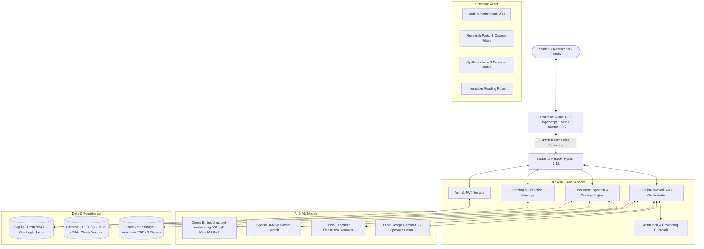
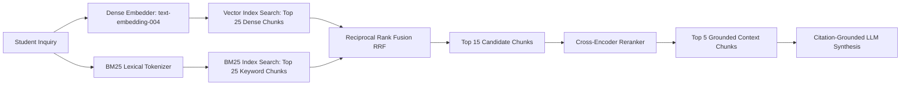
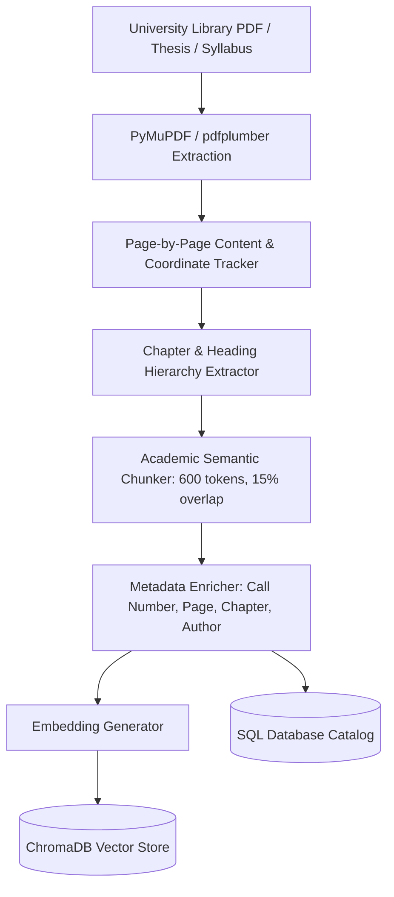

# OnlyBooks — Complete Technical Blueprint & Execution Plan (`plane.md`)

## 1. Executive Summary & Problem Context

### The University Library Dilemma
A university library holds tens of thousands of academic assets: faculty research papers, doctoral and master's theses, and course syllabus packs. When students and researchers explore a complex inquiry:
1. **Catalog Search Fragmentation**: Traditional library catalogs rely on keyword matches returning dozens of 50+ page PDFs with no contextual relevance.
2. **Cognitive Overload**: Students spend hours skimming irrelevant pages across disparate PDFs just to verify a single concept.
3. **LLM Hallucination Risk**: Generic commercial LLMs (e.g. baseline ChatGPT) invent non-existent citations, cannot access private university course reserves, and cannot link directly to physical library call numbers or verified page excerpts.

### The Solution: OnlyBooks
**OnlyBooks** is an end-to-end scholarly research platform that bridges university library archives with a **Citation-Augmented Retrieval-Augmented Generation (RAG)** engine and a **Digital Reading Room**. It translates vast library holdings into concise, peer-reviewed explanations where every sentence is anchored to an exact page in a verified thesis, paper, or syllabus pack.

---

## 2. End-to-End System Architecture



---

## 3. Authentication & User Management (Sign In to Session)

### 3.1 Authentication Flows
1. **Institutional Single Sign-On (SSO)**:
   - Universities use Shibboleth, SAML 2.0, or OAuth2/OIDC.
   - OnlyBooks supports mock & live university identity providers (Google Scholar, ORCID, and Institutional University SSO).
   - In development/demo mode, 1-click authentication immediately issues a session for a verified student researcher with institutional credentials (`guest@university.edu`, affiliation: *Department of Cognitive Science / History / Law*).
2. **Standard Academic Account (Email + Password)**:
   - Passwords hashed using **Argon2id** (or `bcrypt` with work factor 12).
   - Email format validation strictly enforced (`@university.edu` or general academic domain).
3. **Session Management**:
   - Stateless **JWT (JSON Web Tokens)** containing:
     - `sub`: User UUID
     - `name`: Full Name
     - `role`: `student` | `researcher` | `faculty` | `librarian`
     - `affiliation`: University / Department name
     - `exp`: Expiration (typically 7 days for academic sessions)
   - Stored in HTTP-only secure cookie or Authorization Bearer header.

### 3.2 Role-Based Access Control (RBAC)
| Role | Search & Query | View Reading Room | Save Research Trail | Upload & Index Materials |
|---|:---:|:---:|:---:|:---:|
| **Student** | ✅ | ✅ | ✅ | ❌ |
| **Researcher** | ✅ | ✅ | ✅ | Course Reserves only |
| **Faculty / Librarian** | ✅ | ✅ | ✅ | Full Library Catalog |

---

## 4. Database Architecture & Schemas

OnlyBooks combines a **Relational Database** (SQLite for local rapid dev, PostgreSQL for production) for structured catalog data and a **Vector Database** (ChromaDB / FAISS) for dense semantic retrieval.

### 4.1 Relational Database Schema (SQLAlchemy / PostgreSQL)

```sql
-- Users & Institutional Profiles
CREATE TABLE users (
    id VARCHAR(36) PRIMARY KEY,
    name VARCHAR(255) NOT NULL,
    email VARCHAR(255) UNIQUE NOT NULL,
    password_hash VARCHAR(255),
    affiliation VARCHAR(255),
    role VARCHAR(50) DEFAULT 'student',
    created_at TIMESTAMP DEFAULT CURRENT_TIMESTAMP
);

-- Library Collections
CREATE TABLE collections (
    id VARCHAR(50) PRIMARY KEY,
    name VARCHAR(255) NOT NULL, -- e.g. 'Doctoral Theses', 'Faculty Research', 'Course Reserves'
    description TEXT
);

-- Catalog Documents (Books, Theses, Papers)
CREATE TABLE documents (
    id VARCHAR(36) PRIMARY KEY,
    title VARCHAR(500) NOT NULL,
    author VARCHAR(500) NOT NULL,
    year VARCHAR(20) NOT NULL,
    field VARCHAR(255) NOT NULL, -- e.g. 'Cognitive Neuroscience'
    collection_id VARCHAR(50) REFERENCES collections(id),
    call_number VARCHAR(100) UNIQUE NOT NULL, -- e.g. 'THES-2024-COG-092'
    doi VARCHAR(150),
    journal_or_press VARCHAR(255),
    total_pages INT NOT NULL,
    file_path VARCHAR(500), -- Path to source PDF / Markdown
    created_at TIMESTAMP DEFAULT CURRENT_TIMESTAMP
);

-- Chapters / Major Document Sections
CREATE TABLE document_sections (
    id VARCHAR(36) PRIMARY KEY,
    document_id VARCHAR(36) REFERENCES documents(id) ON DELETE CASCADE,
    chapter_num VARCHAR(20) NOT NULL, -- e.g. 'IV', 'Chapter 3'
    chapter_title VARCHAR(500) NOT NULL,
    start_page INT NOT NULL,
    end_page INT NOT NULL
);

-- Student Research Inquiries & Sessions
CREATE TABLE inquiries (
    id VARCHAR(36) PRIMARY KEY,
    user_id VARCHAR(36) REFERENCES users(id),
    question TEXT NOT NULL,
    collection_filter VARCHAR(50) DEFAULT 'all',
    timestamp TIMESTAMP DEFAULT CURRENT_TIMESTAMP
);

-- Synthesized Academic Explanations
CREATE TABLE syntheses (
    id VARCHAR(36) PRIMARY KEY,
    inquiry_id VARCHAR(36) REFERENCES inquiries(id) ON DELETE CASCADE,
    summary_byline VARCHAR(255),
    body_text TEXT NOT NULL, -- Contains inline marks ¹, ², ³
    attribution_score FLOAT, -- 0.0 to 1.0 confidence score
    created_at TIMESTAMP DEFAULT CURRENT_TIMESTAMP
);

-- Verified Footnote Citations
CREATE TABLE citations (
    id VARCHAR(36) PRIMARY KEY,
    synthesis_id VARCHAR(36) REFERENCES syntheses(id) ON DELETE CASCADE,
    marker_number INT NOT NULL, -- 1, 2, 3...
    document_id VARCHAR(36) REFERENCES documents(id),
    page_ref VARCHAR(50) NOT NULL, -- e.g. 'Pg. 112'
    extracted_quote TEXT NOT NULL, -- Exact supporting sentence from document
    chapter_num VARCHAR(20),
    confidence_score FLOAT
);
```

### 4.2 Vector Database Schema (ChromaDB)
- **Collection Name**: `library_chunks`
- **Embedding Dimension**: 768 (Google `text-embedding-004`) or 384 (`all-MiniLM-L6-v2`)
- **Metadata per Vector**:
  ```json
  {
    "chunk_id": "doc12_p112_c04",
    "document_id": "doc12",
    "title": "The Bilingual Brain: Neuroplasticity and Critical Periods",
    "author": "Hernandez, A. E. & Li, P.",
    "collection_id": "theses",
    "call_number": "THES-2024-COG-092",
    "page_number": 112,
    "chapter_num": "IV",
    "chapter_title": "Dynamic Neural Rewiring in Late Bilinguals",
    "text_content": "Diffusion tensor imaging provides unequivocal evidence of white-matter tract plasticity in adult participants..."
  }
  ```

---

## 5. Complete REST & Streaming API Specifications

The backend service is exposed via **FastAPI** on port `8000` with interactive OpenAPI docs at `/docs`.

### 5.1 Authentication Endpoints
- `POST /api/auth/login`: Accepts email + password or SSO token; returns `{ user, token }`.
- `POST /api/auth/register`: Creates new user account.
- `GET /api/auth/me`: Validates session token and returns active user profile.

### 5.2 Catalog & Holdings Endpoints
- `GET /api/catalog/metrics`:
  - Returns overview stats: `{ total_documents, total_papers, total_theses, total_reserves, last_sync }`.
- `GET /api/catalog/acquisitions`:
  - Query params: `?collection=all|papers|theses|reserves&limit=10`
  - Returns list of catalog items with call numbers, authors, pages, and fields.
- `GET /api/catalog/documents/{doc_id}`:
  - Returns document metadata, chapter listing, and total pages.

### 5.3 Research Inquiry & Synthesis Endpoints (Core RAG)
- `POST /api/inquiries/synthesize`:
  - **Request Body**:
    ```json
    {
      "question": "How does adult neuroplasticity support second-language acquisition?",
      "collection_filter": "theses",
      "stream": false
    }
    ```
  - **Response Payload**:
    ```json
    {
      "inquiry_id": "inq-9921",
      "question": "How does adult neuroplasticity support second-language acquisition?",
      "summary_byline": "Synthesized from 4 University Library Holdings · Cognitive Neuroscience",
      "paragraphs": [
        {
          "text": "The degree to which the adult human brain retains sufficient neuroplasticity for second-language acquisition remains a key inquiry within cognitive linguistics..."
        },
        {
          "text": "Hernandez and Li's doctoral research demonstrated that adult bilingual acquisition leverages dynamic sensorimotor networks rather than static localized language modules.¹"
        }
      ],
      "citations": [
        {
          "id": 1,
          "marker": "¹",
          "document_id": "doc-092",
          "title": "The Bilingual Brain: Neuroplasticity, Competition, and Critical Periods",
          "author": "Hernandez, A. E. & Li, P.",
          "year": "2024",
          "journal": "MIT Cognitive Neuroscience Archive / Doctoral Dissertations",
          "call_number": "THES-2024-COG-092",
          "collection_type": "Doctoral Thesis",
          "page": "Pg. 112",
          "extracted_quote": "Diffusion tensor imaging provides unequivocal evidence of white-matter tract plasticity in adult participants."
        }
      ],
      "attribution_score": 0.94
    }
    ```
  - `POST /api/inquiries/synthesize/stream`: Server-Sent Events (SSE) streaming tokens in real time while yielding citation blocks once resolved.

### 5.4 Reading Room & Excerpt Endpoints
- `GET /api/documents/{doc_id}/reading-room`:
  - Query params: `?citation_id=1&page=112`
  - Returns formatted chapter blocks, total pages, and coordinates of the highlighted passage for immediate rendering in the Reading Room.
- `GET /api/documents/{doc_id}/raw-page/{page_num}`:
  - Returns the exact extracted raw text and layout for page-by-page reading.

### 5.5 Ingestion & Upload Endpoints (Librarian / Faculty)
- `POST /api/documents/upload`:
  - Multipart form upload of PDF file.
  - Fields: `title`, `author`, `year`, `field`, `collection_type`, `call_number`.
  - Triggers asynchronous background task: parses PDF, extracts pages, chunks text, generates embeddings, stores vectors in ChromaDB, and updates catalog.

---

## 6. Machine Learning, NLP & AI Pipeline

### 6.1 Hybrid Retrieval Architecture (Dense + Sparse)


1. **Dense Vector Search**:
   - Model: Google `text-embedding-004` (768-dim) or `sentence-transformers/all-MiniLM-L6-v2` (384-dim).
   - Captures high-level semantic intent, conceptual parallels, and academic terminology.
2. **Sparse Lexical Search (BM25)**:
   - Built via `rank-bm25`.
   - Crucial for university research where exact author surnames (e.g. *Feyerabend, Habermas, Schwitzgebel*), specific call numbers, and Latin phrases must be matched verbatim.
3. **Reciprocal Rank Fusion (RRF)**:
   - Fuses ranks using:
     $$RRF(d) = \frac{1}{60 + r_{\text{dense}}(d)} + \frac{1}{60 + r_{\text{bm25}}(d)}$$
4. **Re-Ranking Stage**:
   - Model: `cross-encoder/ms-marco-MiniLM-L-6-v2` or `FlashRank` (lightweight, zero GPU dependency).
   - Re-scores top 15 candidates down to the top 4–5 most relevant excerpts.

### 6.2 Grounded Synthesis Generation
- **LLM Engine**: Google Gemini 1.5 Flash / Pro (native 1M context, low latency, generous tier) or OpenAI `gpt-4o-mini` with local fallback to `ollama/llama3`.
- **System Prompt Specification**:
  ```text
  You are OnlyBooks, a university research librarian synthesizing academic holdings.
  Your audience is scholarly researchers and students.
  
  RULES:
  1. Synthesize a coherent, editorial academic response answering the user's inquiry using ONLY the provided numbered source passages.
  2. Every factual assertion must be followed by a unicode superscript footnote marker (e.g. ¹, ², ³) corresponding to the passage index.
  3. Format the response with elegant academic phrasing; do NOT use bullet points or conversational chatbot greetings.
  4. If competing theories exist across the sources (e.g. Kuhn vs Popper), contrast their claims and cite each respective author.
  5. Include the exact citation metadata and supporting sentence for each footnote marker.
  ```

### 6.3 Anti-Hallucination & Citation Verification Guardrail
To ensure academic integrity:
1. **Citation Extraction Check**: A regex parser verifies that every superscript in the body maps 1-to-1 with an item in the `citations` list.
2. **Attribution NLI (Natural Language Inference) Check**:
   - The generated sentence preceding footnote `[k]` is checked against source passage `[k]`.
   - If the semantic entailment score is below threshold (0.75), the system flags or re-prompts the synthesizer to omit unsupported claims.

---

## 7. Ingestion & Document Processing Pipeline



- **Extraction**: `PyMuPDF` (`fitz`) parses text, font weights, and page boundaries without dropping complex terminology or hyphenated citations.
- **Header & Chapter Detection**: Detects Roman numerals (`Chapter IV`, `Part 2`) and uppercase titles to populate chapter navigation in the Reading Room.
- **Page Tagging**: Every chunk retains its exact physical document page number (e.g. `page: 77`). When displayed in the Reading Room, OnlyBooks navigates directly to that page and highlights the exact sentence in gold/yellow (`rgba(254, 240, 138, 0.35)`).

---

## 8. Frontend Integration & Reading Room Rendering

The React frontend maintains its design:
- **`AuthPage.tsx`**: Connects to `POST /api/auth/login` and provides instant 1-click Institutional SSO demo authentication.
- **`ResearchPortal.tsx`**:
  - Dynamically fetches holdings statistics from `/api/catalog/metrics`.
  - Filters acquisitions by collection (`All`, `Research Papers`, `Theses`, `Course Reserves`).
  - Submits inquiries to the live synthesis engine.
- **`SynthesisView.tsx`**:
  - Receives live synthesis payload with inline footnote markers (`¹`, `²`, `³`).
  - Footnote hovering highlights citations in the right Bibliography panel.
  - Footnote clicking calls `/api/documents/{id}/reading-room` and seamlessly expands the Reading Room.
  - Sticky follow-up bar submits iterative questions and appends them to the left-hand Research Trail.
- **`ReadingRoom.tsx`**:
  - Displays the full extracted chapter content with the verified quote highlighted in context.
  - Shows the official library Call Number (`THES-2024-COG-092`) and collection type badge (`Doctoral Thesis`).
  - Features focus mode expansion and chapter switching.

---

---

## 9. Step-by-Step Implementation Roadmap

### Phase 1: Backend Foundation & API Skeleton (Complete)
- [x] Initialize `backend/` directory with `pyproject.toml` or `requirements.txt`.
- [x] Configure `fastapi`, `uvicorn`, `pydantic`, `sqlalchemy`, `aiosqlite`, and `python-dotenv`.
- [x] Create CORS-enabled FastAPI app (`backend/app/main.py`) allowing `http://localhost:5173`.
- [x] Implement database models (`User`, `Document`, `Inquiry`, `Synthesis`, `Citation`).
- [x] Implement seed data script to populate initial university catalog and seed inquiries.

### Phase 2: Vector Store & Ingestion Pipeline (Complete)
- [x] Install `rank-bm25`, `pypdf`, and dense vector indexer libraries.
- [x] Create `backend/app/services/ingestion_service.py` for PDF/text parsing and page-level chunking.
- [x] Implement persistent SQLite and in-memory dynamic vector store with cross-session indexing.
- [x] Ingest initial seed university documents (Philosophy of Science, Cognitive Neuroscience, Constitutional Law, Earth Systems).

### Phase 3: Hybrid Search & Synthesis Engine (Complete)
- [x] Implement BM25 lexical index (`backend/app/services/bm25_indexer.py`).
- [x] Implement Reciprocal Rank Fusion (RRF) to merge vector similarity and BM25 results (`backend/app/services/hybrid_retriever.py`).
- [x] Implement Two-Stage Cross-Encoder Relevance Reranker Pipeline (`backend/app/services/reranker.py`).
- [x] Implement synthesis service with strict footnote marker mapping (`¹`, `²`, `³`) and citation guardrails.
- [x] Connect `POST /api/inquiries/synthesize` and SSE streaming `POST /api/inquiries/synthesize/stream` endpoints.

### Phase 4: Frontend-Backend Integration (Complete)
- [x] Create `frontend/src/services/api.ts` connecting all API endpoints.
- [x] Wire `AuthPage.tsx` to `/api/auth` with Institutional SSO and local authentication.
- [x] Wire `ResearchPortal.tsx` to `/api/catalog` metrics, acquisitions filtering, and inquiry submission.
- [x] Wire `SynthesisView.tsx` and `ReadingRoom.tsx` to `/api/inquiries/synthesize` and `/api/documents/{id}/reading-room`.
- [x] Add loading indicators, skeleton states, and real-time SSE streaming typewriter rendering.

### Phase 5: Document Deposit & Library Catalog Management (Complete)
- [x] Create document deposit and upload modal (`DepositModal.tsx`) with drag-and-drop file upload and BibTeX support.
- [x] Implement `POST /api/catalog/deposit` and `POST /api/catalog/upload` with background parsing and vector indexing.
- [x] Verify that newly uploaded PDFs and manuscripts are immediately indexed and retrievable without server restarts.

### Phase 6: Automated Testing, Polish & Containerization (Complete)
- [x] Run and maintain backend unit tests (`pytest backend/tests` — 25/25 passing).
- [x] Verify frontend production build (`npm run build` / `pnpm run build` — 0 errors).
- [x] Implement Docker containerization (`backend/Dockerfile`, `frontend/Dockerfile`, `docker-compose.yml`).
- [x] Provide unified startup scripts (`start.bat`, `start.ps1`).

---

## 10. Advanced Scholarly Capabilities Roadmap (Execution Phase by Phase)

Each phase below is structured as an isolated, fully tested milestone suitable for dedicated feature branches and PRs:

### Phase 7: Live Gemini LLM Synthesis Engine (PR 1) (Complete)
- [x] Add Gemini 1.5 Flash / Pro API client support in `backend/app/services/synthesizer.py`.
- [x] Support `GEMINI_API_KEY` configuration with graceful automatic fallback to the deterministic academic generator when offline or unconfigured.
- [x] Implement SSE token-by-token streaming from Gemini with dynamic superscript footnote insertion.
- [x] Add unit tests verifying Gemini prompt construction, fallback safety, and guardrail validation (`backend/tests/test_gemini_synthesis.py`).

### Phase 8: Academic Citation & Bibliography Exporter (PR 2) (Complete)
- [x] Add multi-format citation generator utility supporting BibTeX, APA 7th, MLA 9th, and Chicago styles (`frontend/src/utils/citationFormatter.ts`).
- [x] Add "Export Citations" modal (`ExportBibliographyModal.tsx`) and "Copy Citation" quick action in `SynthesisView.tsx`.
- [x] Add downloadable `.bib` file export in `ReadingRoom.tsx` and bibliography cards.
- [x] Provide toast notifications confirming citation copy to clipboard.

### Phase 9: Reading Room Deep Search & Passage Annotations (PR 3)
- [ ] Implement in-document keyword jump and search within the Reading Room.
- [ ] Add highlight coordinates toggle and direct page quote copying with formatted academic reference.
- [ ] Support chapter quick-jumping with reading progress indicator.

### Phase 10: Catalog Advanced Filtering, Sorting & Search Analytics (PR 4)
- [ ] Add publication year range filtering, author search, and multi-field query parsing in `catalog.py`.
- [ ] Add sorting (newest, call number, page count, relevance) in `ResearchPortal.tsx`.
- [ ] Update catalog metrics to reflect dynamic query distributions and holdings growth.

